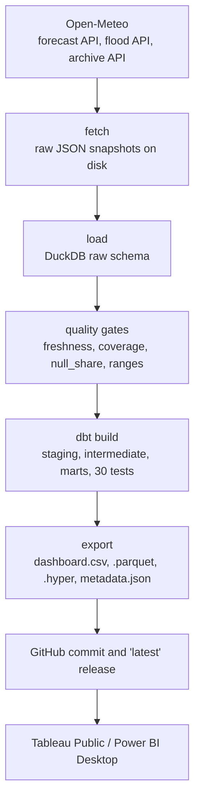

# BahaUlan

BahaUlan pulls Metro Manila rainfall and river discharge from Open-Meteo every morning,
models it with dbt on DuckDB, and publishes a barangay-level extract for Tableau and Power BI.
Each row joins the weather at the nearest grid point to the flood-exposure score that
[BahaMap](https://github.com/Marcus-Chu-Chu/bahamap) computed for that barangay, so you can
ask which places are getting rain and are already exposed to flooding. "Baha" is Filipino for
flood, "ulan" for rain.

[](https://github.com/Marcus-Chu-Chu/bahaulan/actions/workflows/ci.yml)
[](https://github.com/Marcus-Chu-Chu/bahaulan/actions/workflows/pipeline.yml)
[](https://github.com/Marcus-Chu-Chu/bahaulan/releases/tag/latest)

## Dashboard

The workbook is not published yet. The Tableau Public link and screenshots go here once it is.
[`docs/dashboard-build-guide.md`](docs/dashboard-build-guide.md) is the click path for building
it, and the Power BI version alongside it, from the release files.

Four views are planned, one per export file:

1. A barangay map of `wet_exposure`, with a date slider across the 37-day window: 30 days
   back from the run date plus a 7-day forecast. The `source` column says which rows are
   observed (ERA5) and which are model forecast.
2. This year's monthly rainfall against the 2020 to 2025 normal, with the 10th to 90th
   percentile band behind it.
3. The forecast week hour by hour, colored by PAGASA-style warning band.
4. River discharge per grid point, past days and forecast days on one line.

The data behind them is not committed to this repo. It is downloaded from the
[latest release](https://github.com/Marcus-Chu-Chu/bahaulan/releases/tag/latest) at stable
URLs of the form
`https://github.com/Marcus-Chu-Chu/bahaulan/releases/download/latest/dashboard.csv`, with
`dashboard.hyper`, `dashboard.parquet` and `warnings.csv` alongside it under the same
pattern. Power BI's Web connector can point at the `dashboard.csv` URL and refresh from it
directly. Tableau reads `dashboard.hyper` from the same release.

## What it does

- Ingests three Open-Meteo endpoints for 31 grid points on a 0.05 degree lattice over the
  National Capital Region: the forecast API for daily and hourly rainfall, the flood API for
  GloFAS river discharge, and the historical API for an ERA5 backfill from 2020-01-01.
- Models the raw JSON into 13 dbt models over DuckDB and joins it to a seed of 1,710
  barangays across 17 cities and municipalities, carrying population, exposure score and the
  nearest grid point.
- Tests every run: 4 quality gates on the raw tables before dbt starts, then 30 dbt tests
  including two singular tests that check the dashboard has no gaps in its date range and
  covers every barangay through the run date plus 5 days (the last forecast day is excluded
  because only the current run supplies it).
- Publishes `exports/dashboard.csv` at 63,270 rows, which is 1,710 barangays over 37
  continuous days, alongside Parquet, Hyper and a `metadata.json` describing the run.

## Architecture



`docs/architecture.md` covers each stage, what happens when one fails, and the model lineage.
`docs/data-dictionary.md` lists every column in every export file.

## Quickstart

The raw JSON snapshots are committed, so you can rebuild every export without a network call
or an API key.

Windows, PowerShell:

A default Windows execution policy can block the activation script. If
`.\.venv\Scripts\Activate.ps1` errors, run
`Set-ExecutionPolicy -Scope Process RemoteSigned` first.

```powershell
git clone https://github.com/Marcus-Chu-Chu/bahaulan.git
cd bahaulan
py -3.12 -m venv .venv
.\.venv\Scripts\Activate.ps1
pip install -r requirements.txt
python -m pipeline.run --offline
```

macOS and Linux:

```bash
git clone https://github.com/Marcus-Chu-Chu/bahaulan.git
cd bahaulan
python3.12 -m venv .venv
source .venv/bin/activate
pip install -r requirements.txt
python -m pipeline.run --offline
```

`--offline` rebuilds the DuckDB file, the marts and everything in `exports/` from the
snapshots in `data/raw/`. Drop the flag to fetch today's data from Open-Meteo instead:

```bash
python -m pipeline.run
```

The run prints a summary table and appends one row to `logs/runs.csv` with a status of `ok`,
`fetch_failed`, `gate_failed`, `dbt_failed` or `error`. It exits 1 on anything but `ok`.

For the tests, install `requirements-dev.txt` and run `ruff check .` and `pytest -q`.

## Data notes

Rainfall and discharge are model output, not gauge readings. There is no PAGASA station feed
here. Forecasts come from Open-Meteo's roughly 11 km models, past rainfall from ERA5-Land
where available and ERA5 otherwise at roughly 9 to 25 km, and river discharge from GloFAS at
roughly 5 km. Every value is an area average for a grid cell, so two barangays that share a
grid point get identical weather.

ERA5 trails real time by about 5 days. The forecast request asks for 7 past days to cover
that gap, which is why the dashboard has no hole between the last archived day and the first
forecast day. Rows sourced from the archive are marked `observed`; the rest are `forecast`,
including the recent past days.

Warning levels apply the PAGASA rainfall bands (yellow at 7.5 mm/h, orange at 15, red at 30)
to modeled hourly precipitation. They are not PAGASA warnings and carry none of their
authority. The flood API reports in GMT days while the forecast and archive are queried in
Asia/Manila, so `river.csv` dates can sit up to 8 hours off the rainfall dates.

The exposure score, hazard-area share and exposed population come from BahaMap, built from
NOAH hazard maps, PSGC boundaries and the 2020 census.

Attribution: Open-Meteo forecast and historical data under CC BY 4.0; ERA5 and GloFAS from
Copernicus, the Climate Change Service and the Emergency Management Service.

The pipeline runs at 22:00 UTC daily, which is 06:00 in Manila. It commits new snapshots and
log rows back to `main` and refreshes the `latest` release with the seven export files.
Power BI picks up new data when it refreshes against the release CSV URL. Tableau Public
does not refresh on its own, so the published workbook only moves when it is republished by
hand.

## Repository layout

```
pipeline/       fetch, load, quality gates, dbt runner, export, run orchestrator
dbt/            models (staging, intermediate, marts), seeds, tests, profiles
data/raw/       committed JSON snapshots: daily runs and yearly archive windows
exports/        run output: river.csv, monthly_normal.csv, metadata.json are committed;
                dashboard.csv, warnings.csv, dashboard.hyper and dashboard.parquet are not
docs/           architecture, data dictionary, dashboard build guide
dashboards/     Power BI file and screenshots once they exist
logs/runs.csv   one row per run: status, row counts, gate results
tests/          pytest suite with offline fixtures
```

`data/bahaulan.duckdb`, `exports/dashboard.csv`, `exports/warnings.csv`,
`exports/dashboard.hyper` and `exports/dashboard.parquet` are gitignored. The database is
rebuilt on every run, and all four export files are attached to the `latest` release.

## Related projects

[BahaMap](https://github.com/Marcus-Chu-Chu/bahamap) is a barangay-level flood exposure atlas
of Metro Manila.
[BahaTanong](https://github.com/Marcus-Chu-Chu/bahatanong) is a bilingual question-answering
agent over the BahaMap data.

Built with AI-assisted tooling (Claude Code); all data decisions and the published numbers were reviewed by hand.

## License

MIT. See `LICENSE`.
