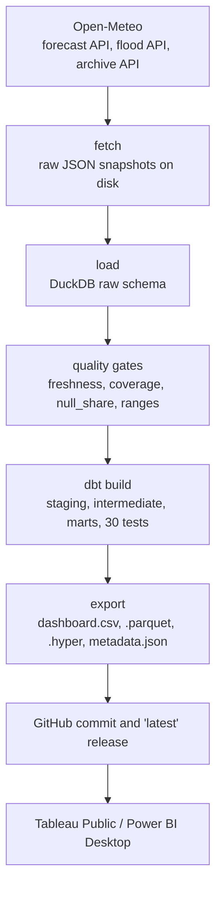

# Architecture

BahaUlan runs one linear DAG once a day. Each stage reads what the stage before it wrote,
so a run can be replayed from the committed JSON snapshots without touching the network.



## Stages

| Stage | Code | Input | Output | If it fails |
|---|---|---|---|---|
| fetch | `pipeline/fetch.py` | Open-Meteo forecast, flood and archive endpoints, 31 grid points in chunks of 30 | `data/raw/<run_date>/forecast.json`, `flood.json`, `data/raw/archive/<start>_<end>.json` | 3 retries with backoff, then `FetchError`; the run is logged as `fetch_failed` and exits 1 without touching the database |
| load | `pipeline/load.py` | the JSON snapshots on disk | DuckDB `raw.forecast_daily`, `raw.forecast_hourly`, `raw.flood_daily`, `raw.archive_daily` | each raw table is rebuilt with `CREATE OR REPLACE` from every snapshot on disk, so a failed load leaves the previous tables in place; the exception is caught and logged as `error` |
| quality gates | `pipeline/quality.py` | the `raw` schema for this run date | four `GateResult` records printed to the run summary | any failing gate stops the run before dbt; status `gate_failed`, exports keep their previous contents |
| dbt build | `dbt/`, driven by `pipeline/dbt_runner.py` | the `raw` schema plus the `dim_barangay` seed | 13 models and 1 seed in the same DuckDB file, 30 data tests | a failing model or test raises with the node names; status `dbt_failed`, exports untouched |
| export | `pipeline/export.py` | the mart tables | `exports/` CSVs, `dashboard.parquet`, `dashboard.hyper`, `metadata.json` | everything is written to `exports.tmp/` first and moved into place only after every file has been written |
| publish | `.github/workflows/pipeline.yml` | the files the export stage wrote | a commit on `main` for `data/raw`, `river.csv`, `monthly_normal.csv`, `metadata.json` and `logs`, plus all seven extracts on the `latest` release | the commit step is a no-op when nothing changed; a failed upload fails the job and the previous release assets stay in place |

Every run appends one row to `logs/runs.csv` with the run date, duration, status, row counts
and the gate results. The statuses are `ok`, `fetch_failed`, `gate_failed`, `dbt_failed` and
`error`.

## Quality gates

The gates run against the raw tables before dbt, so bad upstream data never reaches a mart.

- `freshness`: the forecast for this run date reaches at least 6 days ahead.
- `coverage`: every active grid point appears in both `forecast_daily` and `flood_daily`.
- `null_share`: at most 5 percent of `precipitation_sum` values are null.
- `ranges`: no daily rainfall below 0 mm or above 500 mm, no negative discharge.

## Idempotency

`data/raw/` is the only durable state. `data/bahaulan.duckdb` is gitignored and is rebuilt
from the snapshots on every run: `load_all` rebuilds each `raw` table from the full set of
files under `data/raw/` with `CREATE OR REPLACE`, and every
dbt model is a table or a view rebuilt by `dbt build`. Running the pipeline twice on the same
snapshots produces the same marts and the same CSV bytes, which is what makes
`python -m pipeline.run --offline` a usable test in CI.

Two places deduplicate on purpose. `stg_archive_daily` keeps the most recently fetched
non-null value per grid point and day, because overlapping archive windows can return the
same day twice. `int_rain_daily_unioned` prefers an observed archive value over a forecast
value for the same day, and among forecasts keeps the row from the latest run date.

## Model lineage

Rainfall, from raw days to the dashboard grain:

```
stg_forecast_daily ┐
stg_archive_daily  ┴─> int_rain_daily_unioned -> int_rain_rolling -> fct_rain_barangay_daily -> mart_dashboard
```

Hourly warning bands, joined back into the daily rainfall fact:

```
stg_forecast_hourly -> fct_warnings_hourly -> int_warnings_daily -> fct_rain_barangay_daily
```

River discharge, kept at grid grain because GloFAS cells do not map cleanly to barangays:

```
stg_flood_daily -> fct_river_grid_daily
```

Long-run rainfall normals from the ERA5 archive:

```
stg_archive_daily -> mart_monthly_normal
```

`int_latest_run` is a one-row view holding `max(run_date)` from `stg_forecast_daily`.
`fct_warnings_hourly`, `fct_river_grid_daily` and `mart_dashboard` join to it so that a
snapshot from an older run date cannot leak into the current dashboard.

The barangay join is a seed, not an API call. `dbt/seeds/dim_barangay.csv` carries 1,710
barangays with their PSGC code, city, population, BahaMap exposure score and the id of the
nearest grid point. `pipeline/build_seed.py` regenerates it from the BahaMap export.

## Scheduling

`.github/workflows/pipeline.yml` runs at 22:00 UTC, which is 06:00 in Asia/Manila. The job
commits changed snapshots, the committed export files and log rows back to `main`, then pulls
with rebase before pushing to avoid racing a concurrent push to `main`. It uploads all seven
extracts (`dashboard.csv`, `dashboard.hyper`, `dashboard.parquet`, `warnings.csv`,
`river.csv`, `monthly_normal.csv`, `metadata.json`) to the `latest` release, and keeps a copy
of `exports/` as a build artifact for 14 days. A `concurrency` group named `pipeline` also
stops two runs from pushing at once, and the job has a 30-minute timeout.
